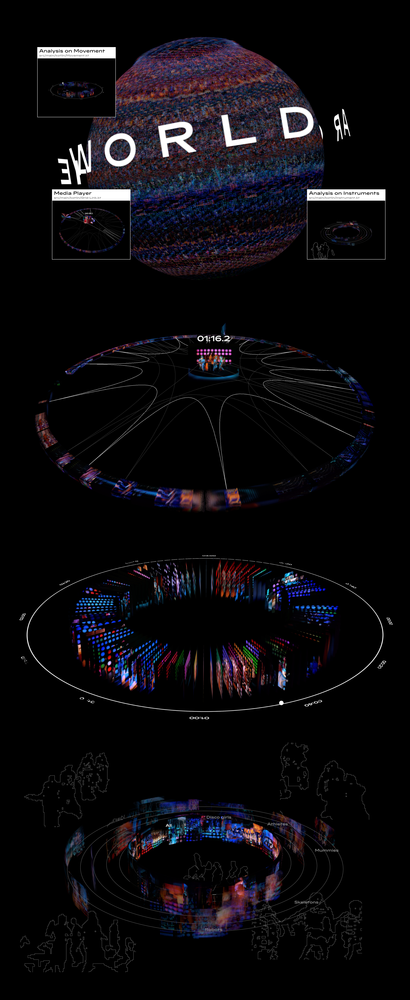

# Around the World - Interactive Data Visualization

An interactive real-time visualization built with [OPENRNDR](https://openrndr.org), synchronized to the audio stems of
Daft Punk's *Around the World*.



## Features

- 3D point cloud and radial segment visualizations driven by audio analysis
- Multiple interactive scenes with playback
    - Media Player Scene
    - Audio Analysis Scene
    - Movement Analysis Scene
- Keyboard interactions(R:Restart, SPACE:change scene, BACKSPACE:go to home scene)

## Requirements

- JDK 17+
- IntelliJ IDEA (recommended)

## Project Structure

```
src/main/kotlin/
├── AroundTheWorld.kt       # entry point
└── components/             # reusable rendering components
    ├── rotoscope/          # rotoscope pipeline
    └── ...

data/
├── audio/                  # audio stems (.ogg)
├── characters/             # frame sequences per character type
├── extracted/around-the-world/  # tilesheet, video, pose & detection data
├── fonts/
└── segments/               # time-coded performer label data
```

## Team

Developed as part of the ECAL MA Digital Experience Design workshop with RNDR Studio.

- Cindy Murier
- Brantschen Delphine
- Shinyoung Park

Supervised by Edwin Jakobs

## Built With

- [OPENRNDR](https://github.com/openrndr/openrndr) — Kotlin creative coding framework
- [orx](https://github.com/openrndr/orx) — OPENRNDR extensions
